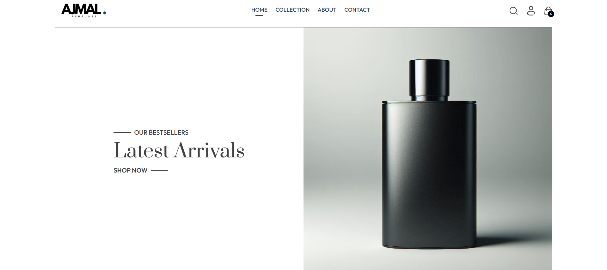
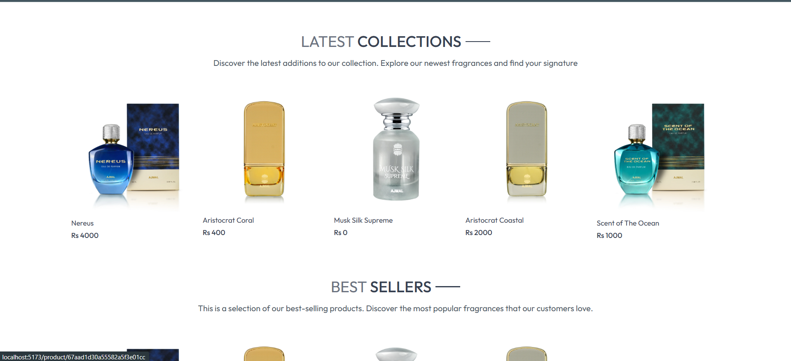
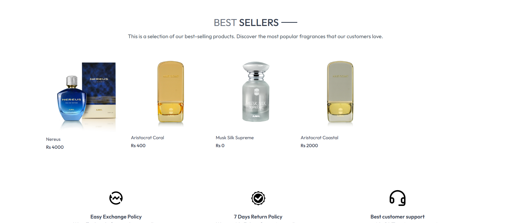
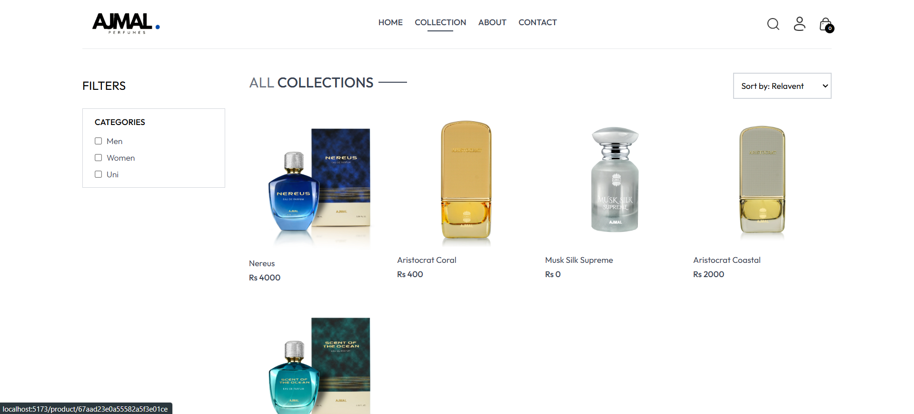
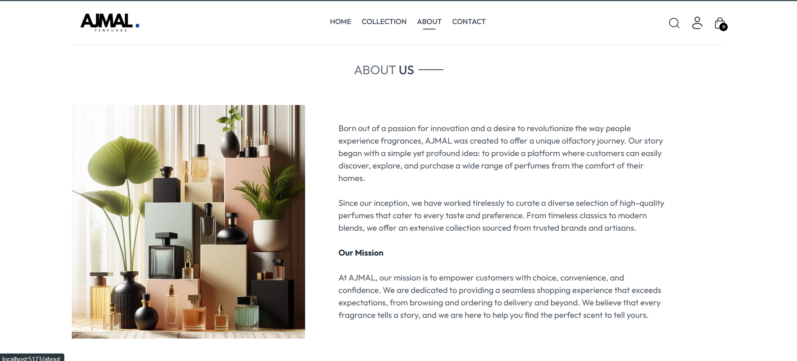
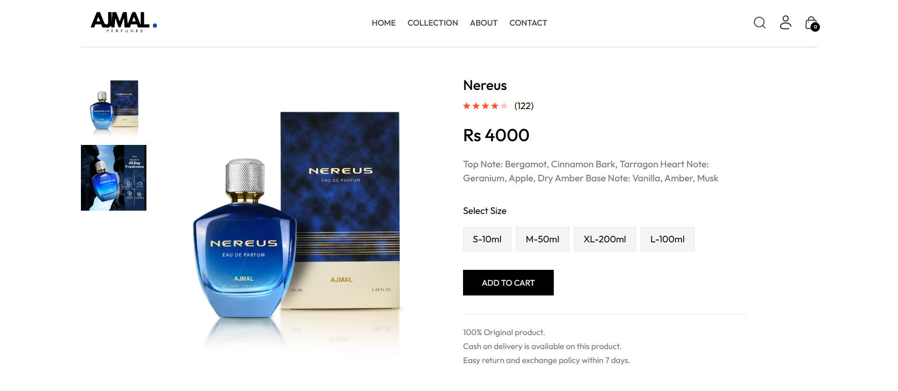
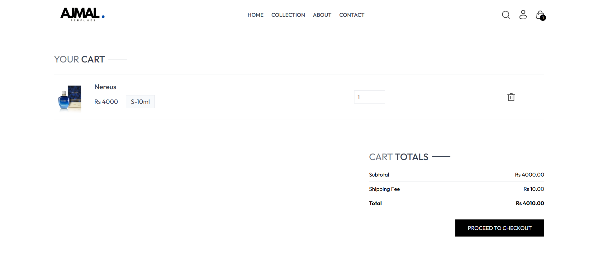
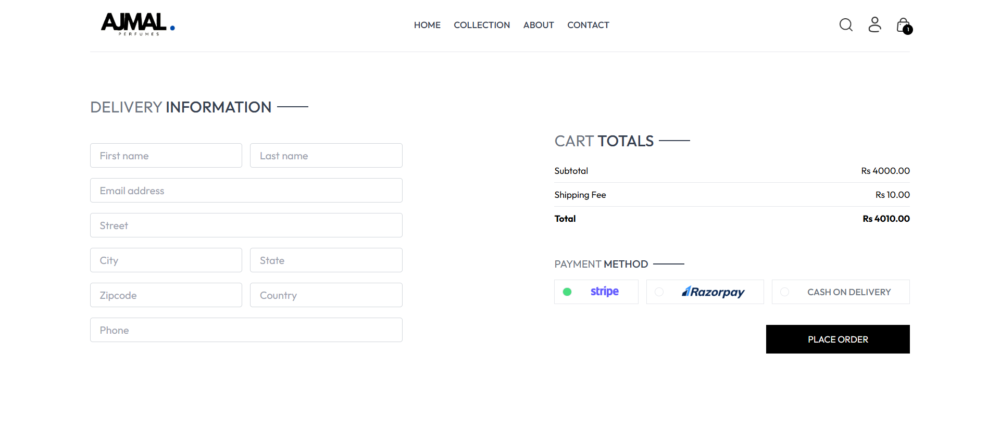

# Perfume Shop – MERN Stack eCommerce Platform  

A full-stack **eCommerce platform** for perfumes built using **MongoDB, Express.js, React.js, and Node.js (MERN stack)**. Users can browse perfumes, view product details, add items to their cart, and place orders securely.  

## Features  

### 🔹 User Features  
- Browse a collection of perfumes.  
- View product details with images and descriptions.  
- Add perfumes to the shopping cart and proceed to checkout.  
- Secure **user authentication** (Login & Signup).  
- Track orders after purchase.  

### 🔹 Admin Features  
- **Admin Dashboard** for managing perfumes and orders.  
- **Product Management** – Add, update, and delete products.  
- **Order Management** – View, update, and track order status.  
- **Image Upload** – Cloudinary or local storage for product images.  

## Tech Stack  

- **Frontend**: React, Redux Toolkit, Tailwind CSS  
- **Backend**: Node.js, Express.js  
- **Database**: MongoDB  
- **Authentication**: JWT & Bcrypt  
- **Image Storage**: Cloudinary (optional)  
- **Payment Gateway**: Razorpay/Stripe (optional)  

## Screenshots  

  
*Home Page*  

  
*Product Listing Page 1*  

  
*Product Listing Page 2*  

  
*Products*  

   

  
*Product Details*  

  
*Cart*  

  

*Order Page*

  
  
  
*Admin Pages*

